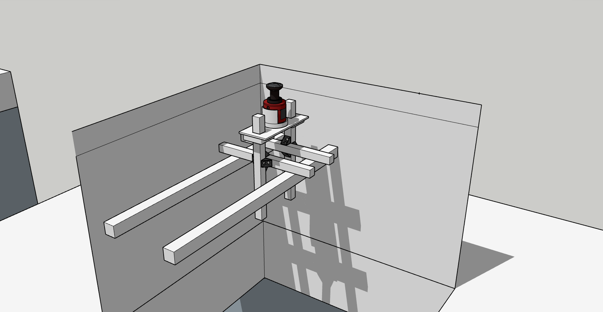
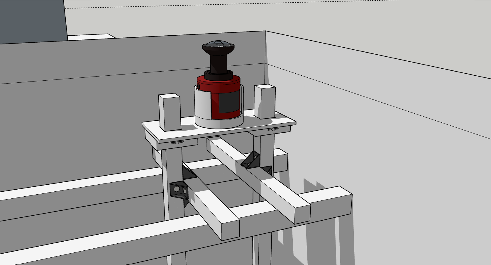
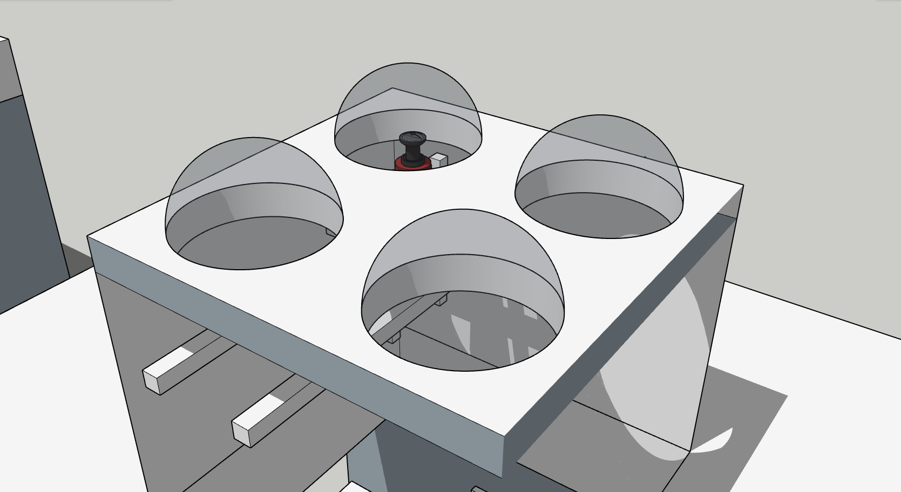
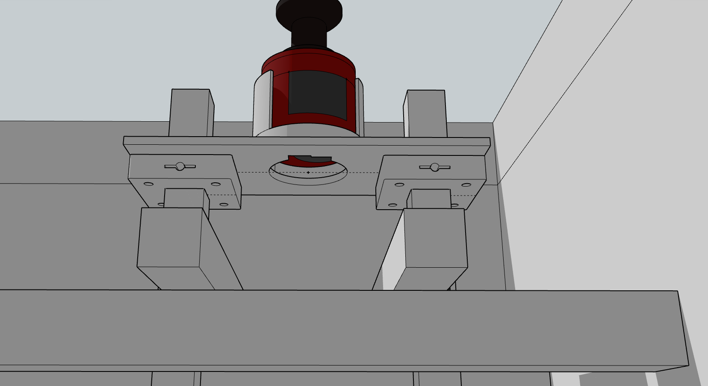

> ⚠️ This repo is under construction.

# ALOASI All-Sky Imager Mount System

## Table of Contents:

- [Cradle and Cover](#cradle-and-cover)
    - [Overview](#overview)
        - [Supported cradle variants](#supported-cradle-variants)
    - [Hardware](#hardware)
        - [Imaging Payload](#imaging-payload)
        - [Mounting Hardware](#mounting-hardware-current--planned)
    - [What's in this repo?](#whats-in-this-repo)
    - [Current Build/Design Status](#current-builddesign-status)
        - [Printable](#printable)
        - [In Progress](#in-progress)
    - [Quickstart](#quickstart)
    - [Printing Notes + Troubleshooting](#printing-notes--troubleshooting)
    - [Contributing / lab use](#contributing--lab-use)
    - [Versioning](#versioning)
- [Mounting Clamps](#mounting-clamps)

## Cradle and Cover

Mechanical design repo for the ALOASI All-Sky Imager ceiling mount hardware: CAD exports (STEP/STL), print profiles, BOMs, rail layouts, and assembly notes for the ZWO ASI183MM Pro + fisheye lens system.

### Overview

This project provides 3D-printed camera cradle options to mount a cylindrical CCD-style camera (ZWO ASI183MM Pro or similar) inside a ceiling cavity/dome while:

- avoiding scratches and pressure points
- keeping vents unobstructed
- preserving access to bottom ports/cables
- providing a stable interface to a ceiling mount/rail system

#### Supported cradle variants

Two cradle variants are maintained for different retention strategies:

- **Foam-Retained Cradle (V5 lineage)**  
  Uses foam padding on the inner walls to retain the camera. No cover required.

- **Mechanically-Locked Cradle + Cover (V7 lineage)**  
  Uses a locking cover + optional side screw mounts to rigidly retain and mount the camera (no foam required).

See `Docs/system-overview.md` for comparison and selection guidance.

### System Context

*Full ceiling cavity context showing rail penetration and mount location.*

*Camera cradle mounted to board base and rail support structure.*

*Ceiling plate with multiple dome apertures used for clearance validation.*

### Hardware

#### Imaging payload
- ZWO **ASI183MM Pro**
- Fujinon **FE185C086HA** fisheye lens

#### Fabrication
- Printer: Creality K1C 3D Printer
- Materials (Cradle/Cover): Hyper-PLA (prototyping), PETG (functional)

> Material choices differ by subsystem: PETG is sufficient for the cradle/camera interface, while clamps benefit from higher stiffness/strength and humidity tolerance (Hyper-PC). 
See [`Docs/Printing/materials.md`](Docs/Printing/materials.md) for rationale and slicer notes.

#### Mounting hardware (current / planned)
- 3030 aluminum T-slot rail, 400 mm (ceiling mount frame)
- 2020 aluminum T-slot rail, 600 mm (ceiling mount frame)
- M5 and/or M6 fasteners
- Triangle brackets / corner braces
- T-nuts (match rail series)

<!-- ### Legacy / alternate
-  -->

### What’s in this repo

**Repo map:**
- [`Docs/`](Docs/)            -> how it works / how to build it
- [`releases/`](releases/)    -> print-ready exports organized by version + variant
- [`cad/`](cad/)              -> editable sources + exports (SketchUp + Onshape links/exports)
- [`lab-notes/`](lab-notes/)  -> print logs + tuning/slicer settings
- [`archive/`](archive/)      -> older iterations kept for reference

### Current build/design status

#### Printable
- **Foam-Retained Cradle (V5 lineage)**
- **Mechanically-Locked Cradle (V8 Lineage)** - Hyper PLA
- **Cover for Cradle (V4 Lineage)** - Hyper PLA

#### In progress
- **Mechanically-Locked Cradle + Cover (V7 lineage)** - PETG testing
- Side screw mounts (M5) for rigid attachment to the board base
- CR-Nylon tuning for improved slit/hex feature fidelity
- Hyper-PC tuning for improved stability and shrink

### Quickstart

1) Choose a cradle variant:
- Foam-Retained (simpler, fewer parts)
- Mechanically-Locked + Cover (more rigid, tighter tolerances)

2) Download the latest release:
- GitHub releases: [Latest Release](../../releases/latest)
- In-repo exports: [`releases/`](releases/)

3) Print:
- See [`cr-nylon.md`](Docs/Printing/cr-nylon.md) or [`Docs/Printing/`](Docs/Printing/) for material notes
- Each release includes `notes.md` with recommended orientation and settings

4) Assemble:
- See [`Docs/assembly.md`](Docs/assembly.md)

### Printing notes + troubleshooting

### Contributing / lab use

- Use clear filenames: `partname_variant_rev_material.stl`
  Example: `cradle_foam_v5_nylon.stl`
<!-- - Log print changes in `lab-notes/test-prints.md` with photo + settings delta
 -->
- Prefer releases for anything used in the lab (avoid printing from `cad/stl-scratch/`)

### Versioning

- **V5 lineage** = Foam-Retained Cradle family
- **V7 lineage** = Mechanically-Locked Cradle + Cover family

Milestones are tagged and exported under [`releases/`](releases/).

## Mounting Clamps

### Overview

### Hardware

#### Fabrication / Materials
- Prototype: Hyper-PLA
- Tested: CR-Nylon (good strength, moisture-sensitive during printing)
- Functional (current): Hyper-PC (preferred for strength + humid environments)

> Material choices differ by subsystem: PETG is sufficient for the cradle/camera interface, while clamps benefit from higher stiffness/strength and humidity tolerance (Hyper-PC).
See [`Docs/Printing/materials.md`](Docs/Printing/materials.md) for rationale and slicer notes.

### Current build/design status

#### Printable

Both designs for the clamps have been finalized:
- [LockingCollarV4-M5](releases/) - Locking collar with M5 sized screw hole and nut
- [LockingCollarV4-M6](releases/) - Locking collar with M6 sized screw hole and nut

### Quick Start

### Printing Notes + Troubleshooting
- CR-Nylon is very sensitive to moisture; drying is required for low-stringing prints.
- See [`Docs/Printing/cr-nylon.md`](Docs/Printing/cr-nylon.md) and [`lab-notes/test-prints.md`](lab-notes/test-prints.md).

### Contributing / lab use

### Versioning

### System Context

*Camera cradle mounted to board base and rail support structure. Board base is sitting on top of the clamps.*

